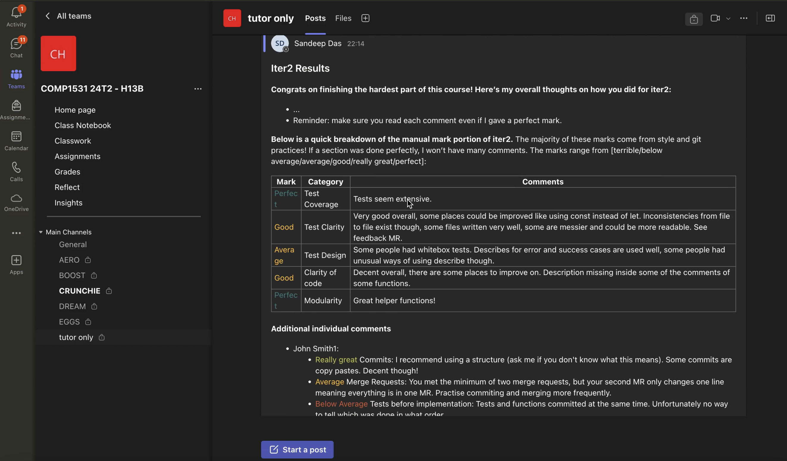

## Purpose
To make COMP1531 marking faster, this script turns the marking spreadsheet feedback into a nice format that can be copy pasted to groups on MS Teams.

## Setup
- *Optional*: setup a virtual environment first:
  - `python3 -m venv env`
  - `source env/bin/activate`
- `pip install -r requirements.txt`

## Instructions
- Open `input/input.xls` and do the following:
  - Row 1: copy paste group categories
  - Row 2: copy paste group feedback
  - Row 3: copy paste individual categories
  - Row 4 and below: copy paste student names and individual feedback
- Run the script: `python3 src/feedback_formatter.py ITERATION_NUM`
  - Open `output/results.md` and hold `ctrl + shift + t` to preview the markdown file.
  - Copy paste the text from the markdown file to give to your classes.

If you wish to disable colouring grades or change which grades are coloured, modify the `ENABLE_COLOUR_GRADES` and `GRADE_RANGE` values in `src/feedback_formatter.py`

## Assumptions

