## Purpose
While I like to use the feedback merge request, I also like to give feedback on MS Teams. This script converts the marking spreadsheet feedback into a nice format that can be given to groups on MS Teams.

### Why use this script?
- **Takes less than a minute to do!**
- In your MyExperience feedback, students wished for more feedback
- Appends a message to the start and end of the feedback
- Pretty colourful output that summarises everything

### Video Demo
**Click below to watch!** Real student names and groups are hidden for privacy reasons. 

## Setup
- Optional: setup a virtual environment first:
  - `python3 -m venv env`
  - `source env/bin/activate`
- `pip install -r requirements.txt`

## Instructions
### Quick instructions
- Copy input into `input/input.xlsx` just like in the video above!
- Run the script `python3 src/feedback_formatter.py ITER_NUM`
- Open `output/results.md`, hold `cmd + shift + v` to preview the markdown file.
- Copy paste the text from the markdown file to give to your classes.

### Detailed instructions
Open `input/input.xlsx` and get the following:

  
1. Group categories

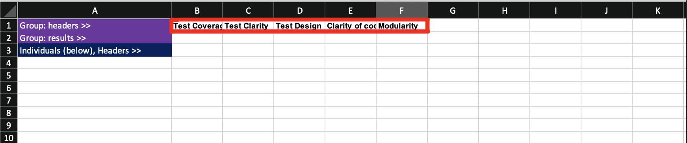

  
2. Group feedback

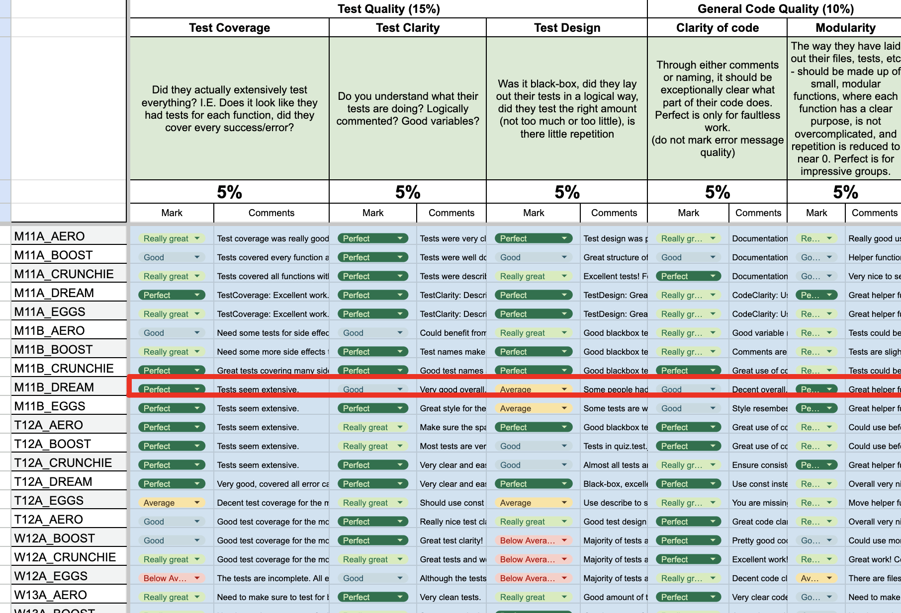
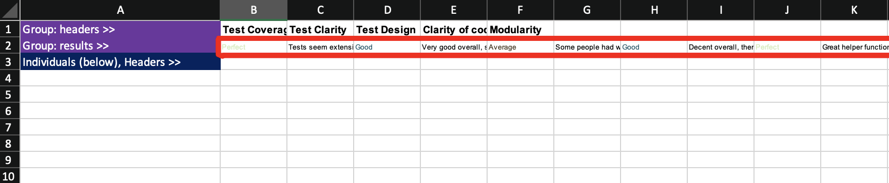

  
3. Individual names

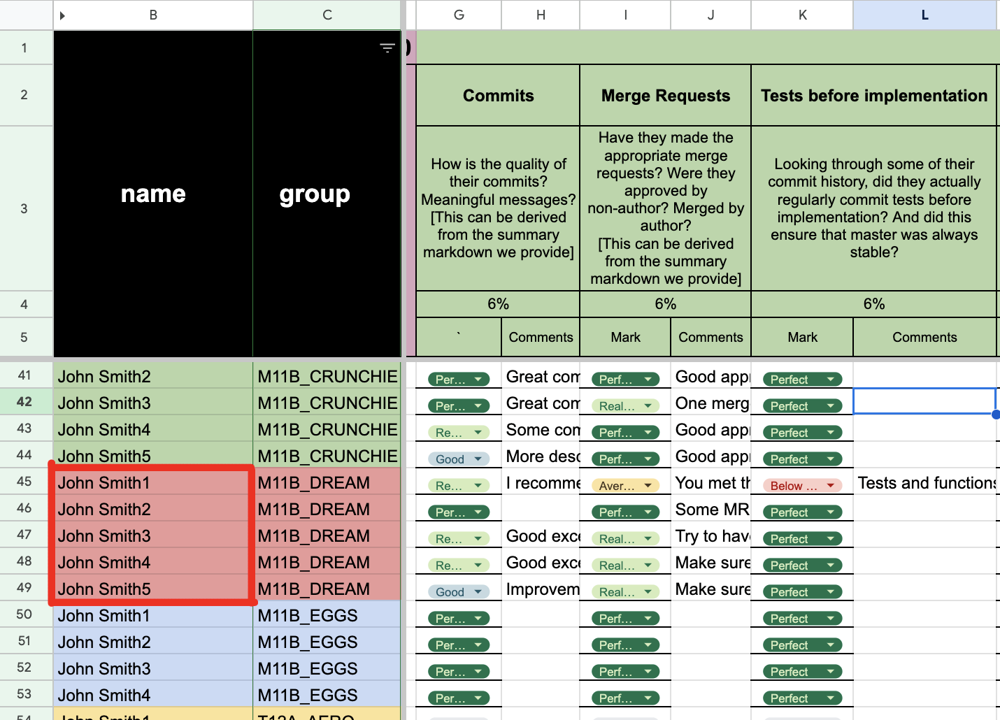
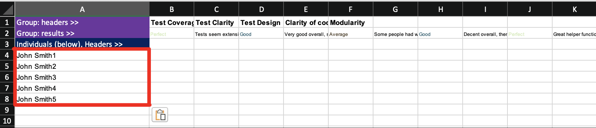

  
4. Individual categories

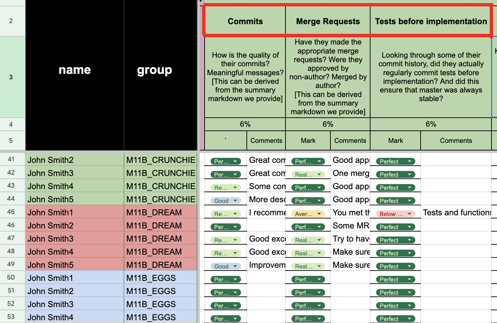
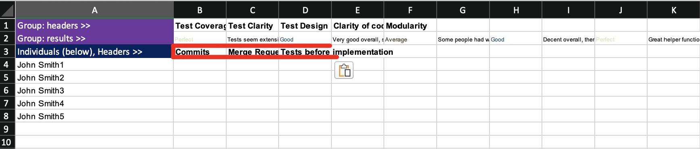

  
5. Individual feedback

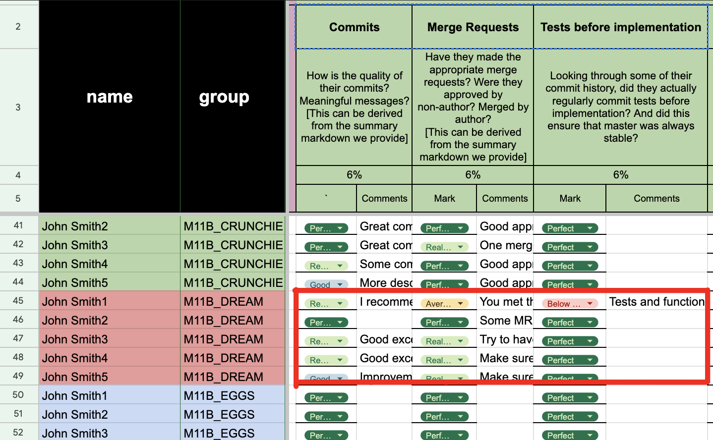
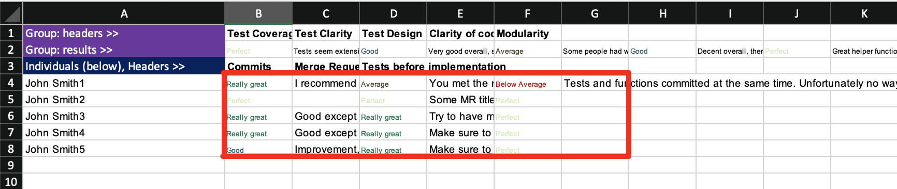

Optionally: you can group together individual categories as group categories
  

    
Instructions

  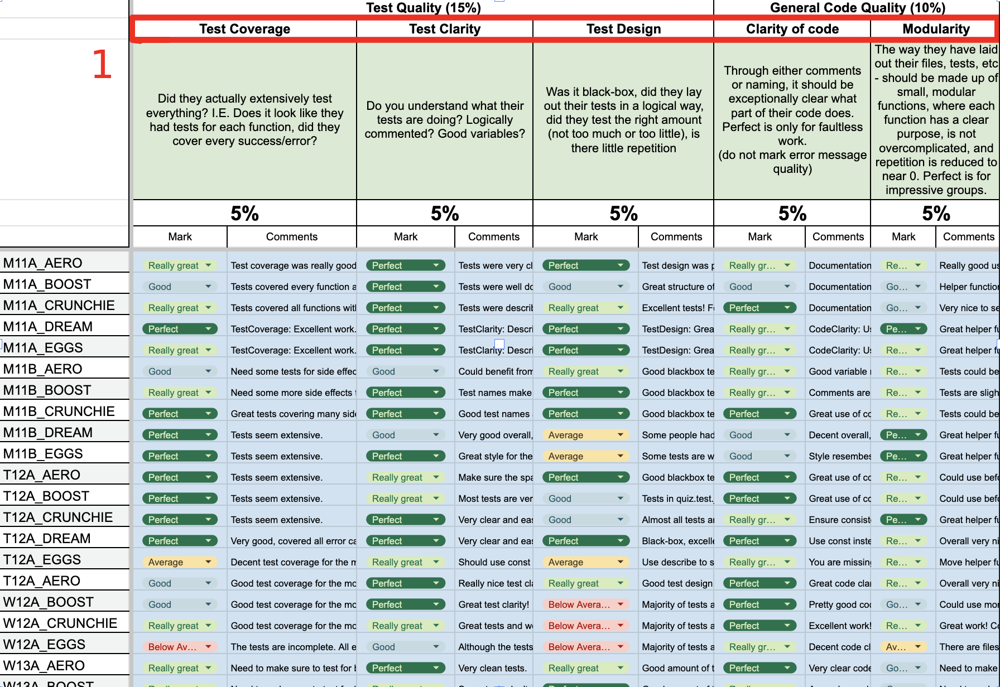
  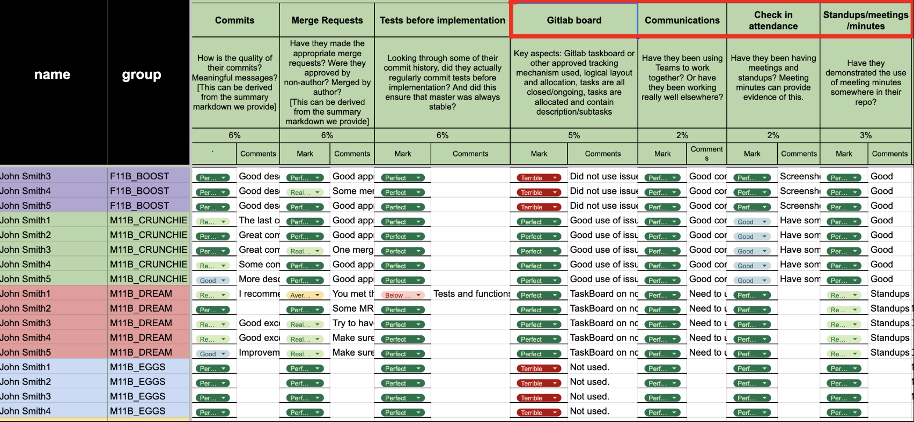
  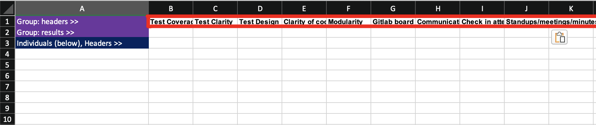
  
  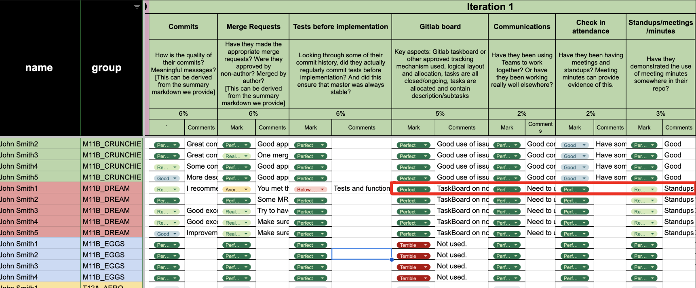
  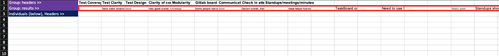
  

___

After everything has been copied in:
- Run the script `python3 src/feedback_formatter.py ITER_NUM`
- Open `output/results.md`, hold `cmd + shift + v` to preview the markdown file.
- Copy paste the text from the markdown file to give to your classes.

## Customising the output
- The contents of the `start message` and the `end message` can be changed in the markdown files in `/input`
- Settings can be configured in `config.yaml`.
  - If no comment is left for a mark, the default comment is: `Nothing to comment on!`.
  - Each grade is coloured either green, light green, yellow or red
